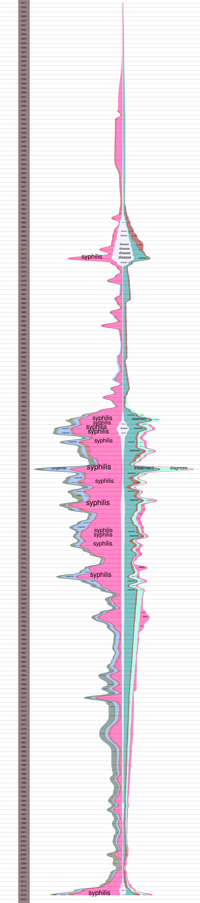

# Syphilis Keyword Genesis and Development

From Fleck's [Genesis and Development of a Scientific Fact](http://www.evolocus.com/Textbooks/Fleck1979.pdf):

    It's as if we wanted to record in writing the natural course of an
    excited conversation among several persons all speaking
    simultaneously among themselves and each clamoring to make himself
    heard, yet which nevertheless permitted a consensus to
    crystallize. The continuity in time of the line of thought already
    mapped out must continually be interrupted to introduce other
    lines. The main line of development often must be held in abeyance
    to explicate connections. Moreover, a great deal has to be
    ommitted to preserve the idealized main line. Instead of a
    description of dynamic interactions, one is left with a more or
    less artificial scheme.

Plotting the "natural course" of such a conversation might be useful
for visual analysis.  The "artificial scheme" can be plotted as a
timeline of term frequencies.

## PubMed Mining

A [search for syphilis in
PubMed](https://www.ncbi.nlm.nih.gov/pubmed/?term=syphilis) yields 33,659
citations, spanning years 1817 to 2016.

[MeSH terms](https://www.nlm.nih.gov/mesh/meshhome.html) are extracted
from each citation, when they were available, or keywords are chosen
from the title or abstract using
[Pattern](http://www.clips.ua.ac.be/pages/pattern-vector), a natural
language processor.

## RiverPlot

